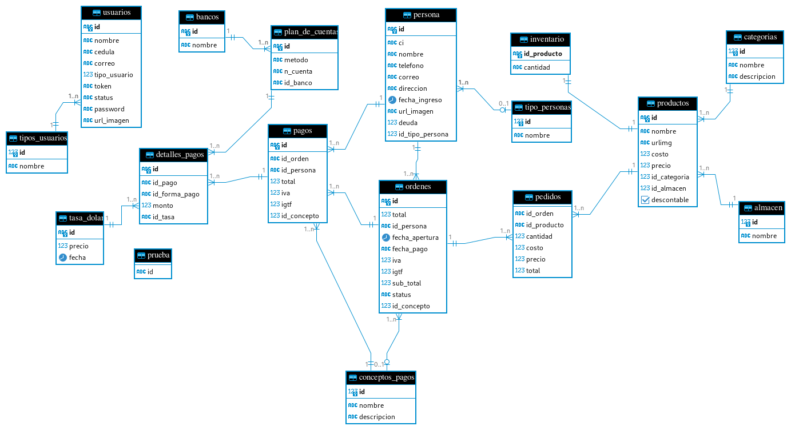

# Tablas para la base de datos ede padel 

+ el sistema esta realizado con le motor de base de datos postgresql en casod e adaptarlo a otro motor de base de datos deberia de cambiar las sentencias sql paara adaptarlo de igual forma se le anexa una diagrama de entidad rela el cual debe seguir rigurosamente 


```sql
-- public.almacen definition

-- Drop table

-- DROP TABLE public.almacen;

CREATE TABLE public.almacen (
	id int4 NOT NULL,
	nombre varchar NOT NULL,
	CONSTRAINT almacen_pk PRIMARY KEY (id)
);

-- Permissions

ALTER TABLE public.almacen OWNER TO padel;
GRANT ALL ON TABLE public.almacen TO padel;


-- public.bancos definition

-- Drop table

-- DROP TABLE public.bancos;

CREATE TABLE public.bancos (
	id varchar NOT NULL,
	nombre varchar NOT NULL,
	CONSTRAINT bancos_pk PRIMARY KEY (id),
	CONSTRAINT bancos_un UNIQUE (nombre)
);

-- Permissions

ALTER TABLE public.bancos OWNER TO postgres;
GRANT ALL ON TABLE public.bancos TO postgres;


-- public.categorias definition

-- Drop table

-- DROP TABLE public.categorias;

CREATE TABLE public.categorias (
	id int4 NOT NULL,
	nombre varchar NOT NULL,
	descripcion varchar NULL,
	CONSTRAINT categorias_pk PRIMARY KEY (id)
);

-- Permissions

ALTER TABLE public.categorias OWNER TO padel;
GRANT ALL ON TABLE public.categorias TO padel;


-- public.conceptos_pagos definition

-- Drop table

-- DROP TABLE public.conceptos_pagos;

CREATE TABLE public.conceptos_pagos (
	id int4 NOT NULL,
	nombre varchar NOT NULL,
	descripcion varchar NULL,
	CONSTRAINT conceptos_pagos_pk PRIMARY KEY (id),
	CONSTRAINT conceptos_pagos_un UNIQUE (nombre)
);

-- Permissions

ALTER TABLE public.conceptos_pagos OWNER TO padel;
GRANT ALL ON TABLE public.conceptos_pagos TO padel;


-- public.prueba definition

-- Drop table

-- DROP TABLE public.prueba;

CREATE TABLE public.prueba (
	id varchar NULL
);

-- Permissions

ALTER TABLE public.prueba OWNER TO postgres;
GRANT ALL ON TABLE public.prueba TO postgres;
GRANT ALL ON TABLE public.prueba TO padel;


-- public.tasa_dolar definition

-- Drop table

-- DROP TABLE public.tasa_dolar;

CREATE TABLE public.tasa_dolar (
	id varchar NOT NULL,
	precio numeric NOT NULL,
	fecha timestamp NOT NULL,
	CONSTRAINT tasa_dolar_pk PRIMARY KEY (id)
);

-- Permissions

ALTER TABLE public.tasa_dolar OWNER TO padel;
GRANT ALL ON TABLE public.tasa_dolar TO padel;


-- public.tipo_personas definition

-- Drop table

-- DROP TABLE public.tipo_personas;

CREATE TABLE public.tipo_personas (
	id int4 NOT NULL,
	nombre varchar NOT NULL,
	CONSTRAINT tipo_personas_pk PRIMARY KEY (id)
);

-- Permissions

ALTER TABLE public.tipo_personas OWNER TO padel;
GRANT ALL ON TABLE public.tipo_personas TO padel;


-- public.tipos_usuarios definition

-- Drop table

-- DROP TABLE public.tipos_usuarios;

CREATE TABLE public.tipos_usuarios (
	id int4 NOT NULL,
	nombre varchar NOT NULL,
	CONSTRAINT tipos_usuarios_pk PRIMARY KEY (id)
);

-- Permissions

ALTER TABLE public.tipos_usuarios OWNER TO padel;
GRANT ALL ON TABLE public.tipos_usuarios TO padel;


-- public.persona definition

-- Drop table

-- DROP TABLE public.persona;

CREATE TABLE public.persona (
	ci varchar NOT NULL,
	nombre varchar NOT NULL,
	telefono varchar NOT NULL,
	correo varchar NULL,
	direccion varchar NULL,
	fecha_ingreso timestamp NOT NULL,
	url_imagen varchar NULL DEFAULT 'https://www.google.com/imgres?imgurl=https%3A%2F%2Fpreviews.123rf.com%2Fimages%2Fylivdesign%2Fylivdesign2101%2Fylivdesign210102017%2F162572026-icono-de-cliente-estilo-de-esquema.jpg&tbnid=qyxQPn0J7Mtr0M&vet=12ahUKEwj9983x4_iDAxVpYTABHTF6B-UQMygEegUIARCAAQ..i&imgrefurl=https%3A%2F%2Fes.123rf.com%2Fphoto_162572026_icono-de-cliente-estilo-de-esquema.html&docid=ngLMwSLUgWLwdM&w=1300&h=1300&q=clientes&hl=es-419&client=firefox-b-e&ved=2ahUKEwj9983x4_iDAxVpYTABHTF6B-UQMygEegUIARCAAQ'::character varying,
	deuda numeric NOT NULL DEFAULT 0.0,
	id varchar NOT NULL,
	id_tipo_persona int4 NULL,
	CONSTRAINT clientes_pk PRIMARY KEY (id),
	CONSTRAINT clientes_un UNIQUE (nombre),
	CONSTRAINT clientes_un_ci UNIQUE (ci),
	CONSTRAINT persona_fk FOREIGN KEY (id_tipo_persona) REFERENCES public.tipo_personas(id)
);

-- Permissions

ALTER TABLE public.persona OWNER TO postgres;
GRANT ALL ON TABLE public.persona TO postgres;


-- public.plan_de_cuentas definition

-- Drop table

-- DROP TABLE public.plan_de_cuentas;

CREATE TABLE public.plan_de_cuentas (
	id varchar NOT NULL,
	metodo varchar NOT NULL,
	n_cuenta varchar NOT NULL,
	id_banco varchar NOT NULL,
	CONSTRAINT plan_de_cuentas_pk PRIMARY KEY (id),
	CONSTRAINT plan_de_cuentas_un UNIQUE (metodo, n_cuenta),
	CONSTRAINT plan_de_cuentas_fk FOREIGN KEY (id_banco) REFERENCES public.bancos(id)
);

-- Permissions

ALTER TABLE public.plan_de_cuentas OWNER TO postgres;
GRANT ALL ON TABLE public.plan_de_cuentas TO postgres;


-- public.productos definition

-- Drop table

-- DROP TABLE public.productos;

CREATE TABLE public.productos (
	id varchar NOT NULL,
	nombre varchar NULL,
	urlimg varchar NULL,
	costo numeric NULL,
	precio numeric NULL,
	id_categoria int4 NOT NULL,
	id_almacen int4 NOT NULL,
	descontable bool NULL,
	CONSTRAINT productos_pk PRIMARY KEY (id),
	CONSTRAINT productos_un UNIQUE (nombre),
	CONSTRAINT productos_fk FOREIGN KEY (id_categoria) REFERENCES public.categorias(id),
	CONSTRAINT productos_fk_alamcen FOREIGN KEY (id_almacen) REFERENCES public.almacen(id)
);

-- Permissions

ALTER TABLE public.productos OWNER TO padel;
GRANT ALL ON TABLE public.productos TO padel;


-- public.usuarios definition

-- Drop table

-- DROP TABLE public.usuarios;

CREATE TABLE public.usuarios (
	id varchar NOT NULL,
	nombre varchar NOT NULL,
	cedula varchar NOT NULL,
	correo varchar NOT NULL,
	tipo_usuario int4 NOT NULL DEFAULT 4,
	"token" varchar NULL,
	status varchar NOT NULL DEFAULT 'desconectado'::character varying,
	"password" varchar NOT NULL,
	url_imagen varchar NOT NULL DEFAULT 'http:www'::character varying,
	CONSTRAINT usuarios_pk PRIMARY KEY (id),
	CONSTRAINT usuarios_un UNIQUE (cedula),
	CONSTRAINT usuarios_fk FOREIGN KEY (tipo_usuario) REFERENCES public.tipos_usuarios(id)
);

-- Permissions

ALTER TABLE public.usuarios OWNER TO padel;
GRANT ALL ON TABLE public.usuarios TO padel;


-- public.inventario definition

-- Drop table

-- DROP TABLE public.inventario;

CREATE TABLE public.inventario (
	id_producto varchar NOT NULL,
	cantidad varchar NOT NULL,
	CONSTRAINT inventario_pk PRIMARY KEY (id_producto),
	CONSTRAINT inventario_fk FOREIGN KEY (id_producto) REFERENCES public.productos(id)
);

-- Permissions

ALTER TABLE public.inventario OWNER TO padel;
GRANT ALL ON TABLE public.inventario TO padel;


-- public.ordenes definition

-- Drop table

-- DROP TABLE public.ordenes;

CREATE TABLE public.ordenes (
	id varchar NOT NULL,
	total numeric NOT NULL,
	id_persona varchar NOT NULL,
	fecha_apertura timestamp NOT NULL,
	fecha_pago varchar NULL,
	iva numeric NOT NULL DEFAULT 0,
	igtf numeric NOT NULL DEFAULT 0,
	sub_total numeric NULL,
	status varchar NOT NULL,
	id_concepto int4 NULL,
	CONSTRAINT ordenes_pk PRIMARY KEY (id),
	CONSTRAINT ordenes_fk FOREIGN KEY (id_persona) REFERENCES public.persona(id),
	CONSTRAINT ordenes_fk_conceptos FOREIGN KEY (id_concepto) REFERENCES public.conceptos_pagos(id)
);

-- Permissions

ALTER TABLE public.ordenes OWNER TO padel;
GRANT ALL ON TABLE public.ordenes TO padel;


-- public.pagos definition

-- Drop table

-- DROP TABLE public.pagos;

CREATE TABLE public.pagos (
	id varchar NOT NULL,
	id_orden varchar NOT NULL,
	id_persona varchar NOT NULL,
	total numeric NOT NULL,
	iva numeric NULL DEFAULT 0.00,
	igtf numeric NULL DEFAULT 0.00,
	id_concepto int4 NOT NULL,
	CONSTRAINT pagos_pk PRIMARY KEY (id),
	CONSTRAINT pagos_fk FOREIGN KEY (id_orden) REFERENCES public.ordenes(id),
	CONSTRAINT pagos_fk_clientes FOREIGN KEY (id_persona) REFERENCES public.persona(id),
	CONSTRAINT pagos_fk_conceptos FOREIGN KEY (id_concepto) REFERENCES public.conceptos_pagos(id)
);

-- Permissions

ALTER TABLE public.pagos OWNER TO postgres;
GRANT ALL ON TABLE public.pagos TO postgres;


-- public.pedidos definition

-- Drop table

-- DROP TABLE public.pedidos;

CREATE TABLE public.pedidos (
	id_orden varchar NOT NULL,
	id_producto varchar NOT NULL,
	cantidad numeric NOT NULL,
	costo numeric NOT NULL,
	precio numeric NOT NULL,
	total numeric NOT NULL,
	CONSTRAINT pedidos_fk FOREIGN KEY (id_orden) REFERENCES public.ordenes(id),
	CONSTRAINT pedidos_fk_productos FOREIGN KEY (id_producto) REFERENCES public.productos(id)
);

-- Permissions

ALTER TABLE public.pedidos OWNER TO padel;
GRANT ALL ON TABLE public.pedidos TO padel;


-- public.detalles_pagos definition

-- Drop table

-- DROP TABLE public.detalles_pagos;

CREATE TABLE public.detalles_pagos (
	id varchar NOT NULL,
	id_pago varchar NOT NULL,
	id_forma_pago varchar NOT NULL,
	monto numeric NOT NULL,
	id_tasa varchar NOT NULL,
	CONSTRAINT detalles_pagos_pk PRIMARY KEY (id),
	CONSTRAINT detalles_pagos_fk FOREIGN KEY (id_pago) REFERENCES public.pagos(id),
	CONSTRAINT detalles_pagos_fk_forma_de_pago FOREIGN KEY (id_forma_pago) REFERENCES public.plan_de_cuentas(id),
	CONSTRAINT detalles_pagos_fk_tasa_dollar FOREIGN KEY (id_tasa) REFERENCES public.tasa_dolar(id)
);

-- Permissions

ALTER TABLE public.detalles_pagos OWNER TO padel;
GRANT ALL ON TABLE public.detalles_pagos TO padel;
```

